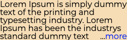
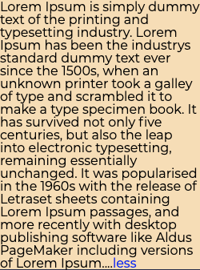

# 測試一、閱讀更多功能實作

## 需求

請撰寫一個元件，接受五個參數：高度、寬度、內文、「閱讀更多」按鈕、「收起」按鈕。當內文溢出預設空間時，顯示「閱讀更多」按鈕並將超出內容隱藏，若無溢出則不顯示。使用者點擊「閱讀更多」按鈕後，顯示完整內容與「收起」按鈕，點擊「收起」按鈕後則恢復原有狀態。

「閱讀更多」與「收起」按鈕**必須**分別位於折疊前與折疊後的最後一行，內文需可接受中文字等。

請於 `src/CollapseText.tsx` 與 `src/CollapseText.css` 作答，並依需求修改其他檔案，你可以增加、修改參數的數量與類型。

## 效果

收起時

展開時

